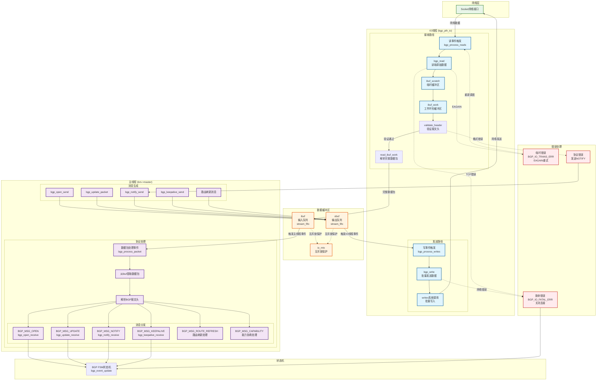

```mermaid
flowchart TD
    %% BGP IO 处理流程图
    
    subgraph "网络层"
        Socket[Socket网络接口]
    end
    
    subgraph "IO线程 (bgp_pth_io)"
        direction TB
        
        subgraph "接收路径"
            ReadEvent[读事件触发<br/>bgp_process_reads]
            ReadFunc[bgp_read<br/>读取原始数据]
            ScratchBuf[ibuf_scratch<br/>临时缓冲区]
            WorkBuf[ibuf_work<br/>工作环形缓冲区]
            Validate[validate_header<br/>验证报文头]
            ParsePkt[read_ibuf_work<br/>解析完整数据包]
        end
        
        subgraph "发送路径"
            WriteEvent[写事件触发<br/>bgp_process_writes]
            WriteFunc[bgp_write<br/>批量发送数据]
            WritevCall[writev系统调用<br/>批量写入]
        end
    end
    
    subgraph "数据缓冲区"
        direction LR
        IBuf[ibuf<br/>输入队列<br/>stream_fifo]
        OBuf[obuf<br/>输出队列<br/>stream_fifo]
        Mutex[io_mtx<br/>互斥锁保护]
    end
    
    subgraph "主线程 (bm->master)"
        direction TB
        
        subgraph "协议处理"
            ProcessEvent[数据包处理事件<br/>bgp_process_packet]
            ExtractPkt[从ibuf提取数据包]
            ParseHeader[解析BGP报文头]
            
            subgraph "消息分发"
                OpenMsg[BGP_MSG_OPEN<br/>bgp_open_receive]
                UpdateMsg[BGP_MSG_UPDATE<br/>bgp_update_receive]
                NotifyMsg[BGP_MSG_NOTIFY<br/>bgp_notify_receive]
                KeepaliveMsg[BGP_MSG_KEEPALIVE<br/>bgp_keepalive_receive]
                RefreshMsg[BGP_MSG_ROUTE_REFRESH<br/>路由刷新处理]
                CapabilityMsg[BGP_MSG_CAPABILITY<br/>能力协商处理]
            end
        end
        
        subgraph "消息生成"
            GenOpen[bgp_open_send]
            GenUpdate[bgp_update_packet]
            GenNotify[bgp_notify_send]
            GenKeepalive[bgp_keepalive_send]
            GenRefresh[路由刷新消息]
        end
    end
    
    subgraph "状态机"
        FSM[BGP FSM状态机<br/>bgp_event_update]
    end
    
    subgraph "错误处理"
        TransErr[临时错误<br/>BGP_IO_TRANS_ERR<br/>EAGAIN重试]
        FatalErr[致命错误<br/>BGP_IO_FATAL_ERR<br/>关闭连接]
        ProtocolErr[协议错误<br/>发送NOTIFY]
    end
    
    %% 接收数据流
    Socket -->|网络数据| ReadEvent
    ReadEvent --> ReadFunc
    ReadFunc --> ScratchBuf
    ScratchBuf --> WorkBuf
    WorkBuf --> Validate
    Validate -->|验证通过| ParsePkt
    ParsePkt -->|完整数据包| IBuf
    IBuf -.->|互斥锁保护| Mutex
    IBuf -->|触发主线程事件| ProcessEvent
    
    %% 数据包处理流程
    ProcessEvent --> ExtractPkt
    ExtractPkt --> ParseHeader
    ParseHeader --> OpenMsg
    ParseHeader --> UpdateMsg
    ParseHeader --> NotifyMsg
    ParseHeader --> KeepaliveMsg
    ParseHeader --> RefreshMsg
    ParseHeader --> CapabilityMsg
    
    %% 发送数据流
    GenOpen --> OBuf
    GenUpdate --> OBuf
    GenNotify --> OBuf
    GenKeepalive --> OBuf
    GenRefresh --> OBuf
    
    OBuf -.->|互斥锁保护| Mutex
    OBuf -->|触发IO线程事件| WriteEvent
    WriteEvent --> WriteFunc
    WriteFunc --> WritevCall
    WritevCall -->|网络发送| Socket
    
    %% 状态机交互
    OpenMsg --> FSM
    UpdateMsg --> FSM
    NotifyMsg --> FSM
    KeepaliveMsg --> FSM
    
    %% 错误处理流程
    ReadFunc -.->|EAGAIN| TransErr
    ReadFunc -.->|TCP错误| FatalErr
    WriteFunc -.->|网络错误| FatalErr
    Validate -.->|格式错误| ProtocolErr
    
    TransErr -.->|重新调度| ReadEvent
    FatalErr --> FSM
    ProtocolErr --> GenNotify
    
    %% 样式定义
    classDef ioThread fill:#e1f5fe,stroke:#01579b,stroke-width:2px
    classDef mainThread fill:#f3e5f5,stroke:#4a148c,stroke-width:2px
    classDef buffer fill:#fff3e0,stroke:#e65100,stroke-width:2px
    classDef network fill:#e8f5e8,stroke:#2e7d32,stroke-width:2px
    classDef error fill:#ffebee,stroke:#c62828,stroke-width:2px
    
    class ReadEvent,ReadFunc,ScratchBuf,WorkBuf,WriteEvent,WriteFunc,WritevCall ioThread
    class ProcessEvent,ExtractPkt,ParseHeader,OpenMsg,UpdateMsg,NotifyMsg,KeepaliveMsg,RefreshMsg,CapabilityMsg,GenOpen,GenUpdate,GenNotify,GenKeepalive,GenRefresh mainThread
    class IBuf,OBuf,Mutex buffer
    class Socket network
    class TransErr,FatalErr,ProtocolErr error
```
