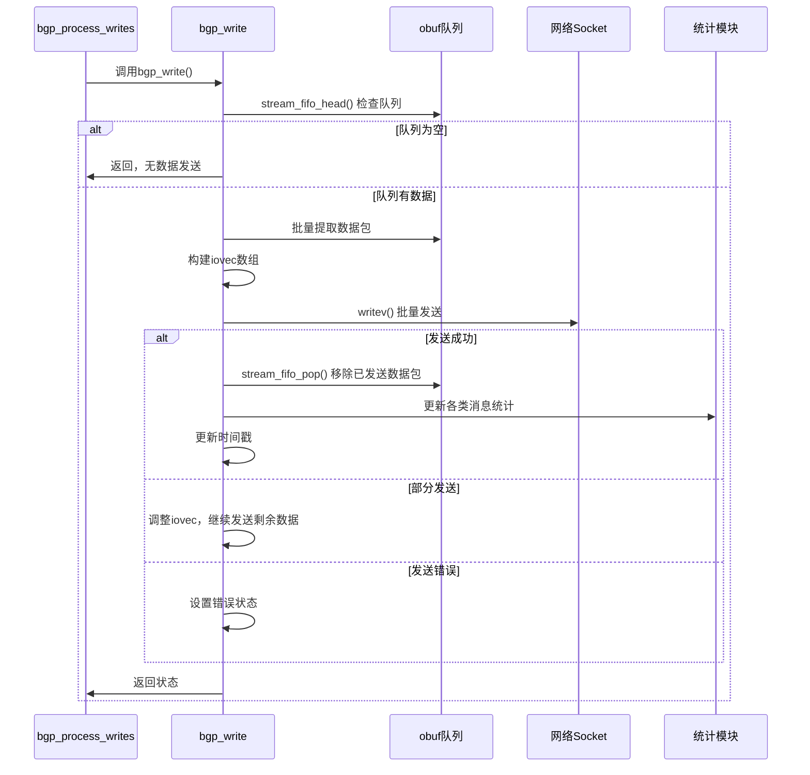

# BGP_WRITE 函数流程详细分析

## 1. 函数概述

`bgp_write` 是BGP输出队列的核心消费函数，负责将输出队列(`obuf`)中的数据包批量发送到网络。这个函数在IO线程中执行，采用高效的批量发送机制。

### 函数签名
```c
static uint16_t bgp_write(struct peer_connection *connection)
```

**返回值**: 状态标志位组合
- `BGP_IO_TRANS_ERR`: 临时错误（EAGAIN等）
- `BGP_IO_FATAL_ERR`: 致命错误

## 2. 函数流程分解

### 阶段1: 初始化和参数准备

```c
struct peer *peer = connection->peer;
uint8_t type;
struct stream *s;
int update_last_write = 0;      // 是否有数据写入标志
unsigned int count;
uint32_t uo = 0;               // UPDATE消息计数
uint16_t status = 0;           // 返回状态
uint32_t wpkt_quanta_old;      // 批量发送配额

// 网络IO相关变量
int writenum = 0;              // 总字节数
int num;                       // 实际写入字节数
unsigned int iovsz;            // iovec数组大小
unsigned int strmsz;           // stream数组大小
unsigned int total_written;    // 已发送完整数据包数
time_t now;

// 获取批量发送配额（原子操作，线程安全）
wpkt_quanta_old = atomic_load_explicit(&peer->bgp->wpkt_quanta, memory_order_relaxed);
```

**关键点**:
- `wpkt_quanta`: 控制每次最多发送的数据包数量
- 使用原子操作确保并发安全

### 阶段2: 数据包批量提取和iovec准备

```c
// 创建批量发送的数据结构
struct stream *ostreams[wpkt_quanta_old];    // 数据包数组
struct stream **streams = ostreams;
struct iovec iov[wpkt_quanta_old];          // 网络IO向量

// 检查输出队列是否为空
s = stream_fifo_head(connection->obuf);
if (!s)
    goto done;  // 队列为空，直接结束

// 批量提取数据包，构建iovec数组
count = iovsz = 0;
while (count < wpkt_quanta_old && iovsz < array_size(iov) && s) {
    ostreams[iovsz] = s;                    // 保存stream引用
    iov[iovsz].iov_base = stream_pnt(s);    // 数据指针
    iov[iovsz].iov_len = STREAM_READABLE(s); // 数据长度
    writenum += STREAM_READABLE(s);          // 累计总字节数
    s = s->next;                            // 下一个数据包
    ++iovsz;
    ++count;
}

strmsz = iovsz;  // 记录原始数据包数量
total_written = 0;
```

**关键机制**:
- **零拷贝**: 直接使用stream中的数据指针，不进行内存拷贝
- **批量聚合**: 一次系统调用发送多个BGP数据包
- **链表遍历**: 通过stream的next指针遍历队列

### 阶段3: 网络发送和部分发送处理

```c
do {
    // 使用writev进行批量发送
    num = writev(connection->fd, iov, iovsz);
    
    if (num < 0) {
        // 网络错误处理
        if (!ERRNO_IO_RETRY(errno)) {
            // 致命错误：连接断开、socket错误等
            BGP_EVENT_ADD(connection, TCP_fatal_error);
            SET_FLAG(status, BGP_IO_FATAL_ERR);
        } else {
            // 临时错误：EAGAIN、EWOULDBLOCK等
            SET_FLAG(status, BGP_IO_TRANS_ERR);
        }
        break;
        
    } else if (num != writenum) {
        // 部分发送情况处理
        unsigned int msg_written = 0;
        unsigned int ic = iovsz;
        
        // 计算完整发送的数据包数量
        for (unsigned int i = 0; i < ic; i++) {
            size_t ss = iov[i].iov_len;
            
            if (ss > (unsigned int) num)
                break;  // 这个数据包没有完全发送
                
            msg_written++;
            iovsz--;
            writenum -= ss;
            num -= ss;
        }
        
        total_written += msg_written;
        assert(total_written < count);
        
        // 调整iovec数组，移除已发送的数据包
        memmove(&iov, &iov[msg_written], sizeof(iov[0]) * iovsz);
        streams = &streams[msg_written];
        
        // 调整部分发送的数据包
        stream_forward_getp(streams[0], num);
        iov[0].iov_base = stream_pnt(streams[0]);
        iov[0].iov_len = STREAM_READABLE(streams[0]);
        
        writenum -= num;
        num = 0;
        assert(writenum > 0);
        
    } else {
        // 全部发送成功
        total_written = strmsz;
    }
    
} while (num != writenum);
```

**核心机制**:
- **writev批量发送**: 一次系统调用发送多个数据包，减少系统调用开销
- **部分发送处理**: 处理TCP发送缓冲区满的情况
- **精确统计**: 准确跟踪每个数据包的发送状态

### 阶段4: 统计更新和资源清理

```c
// 处理已发送的数据包
for (unsigned int i = 0; i < total_written; i++) {
    s = stream_fifo_pop(connection->obuf);  // 从队列中移除
    assert(s == ostreams[i]);
    
    // 解析BGP消息类型进行统计
    stream_set_getp(s, BGP_MARKER_SIZE + 2);
    type = stream_getc(s);
    
    switch (type) {
    case BGP_MSG_OPEN:
        atomic_fetch_add_explicit(&peer->open_out, 1, memory_order_relaxed);
        break;
    case BGP_MSG_UPDATE:
        atomic_fetch_add_explicit(&peer->update_out, 1, memory_order_relaxed);
        uo++;  // UPDATE消息计数
        break;
    case BGP_MSG_NOTIFY:
        atomic_fetch_add_explicit(&peer->notify_out, 1, memory_order_relaxed);
        // NOTIFY特殊处理：倍增重启定时器
        peer->v_start *= 2;
        if (peer->v_start >= (60 * 2))
            peer->v_start = (60 * 2);
        // 触发BGP会话停止
        BGP_EVENT_ADD(connection, BGP_Stop);
        goto done;
    case BGP_MSG_KEEPALIVE:
        atomic_fetch_add_explicit(&peer->keepalive_out, 1, memory_order_relaxed);
        break;
    case BGP_MSG_ROUTE_REFRESH_NEW:
    case BGP_MSG_ROUTE_REFRESH_OLD:
        atomic_fetch_add_explicit(&peer->refresh_out, 1, memory_order_relaxed);
        break;
    case BGP_MSG_CAPABILITY:
        atomic_fetch_add_explicit(&peer->dynamic_cap_out, 1, memory_order_relaxed);
        break;
    }
    
    stream_free(s);       // 释放内存
    ostreams[i] = NULL;   // 清空引用
    update_last_write = 1; // 标记有数据发送
}
```

**统计机制**:
- **按类型统计**: 分别统计各种BGP消息的发送数量
- **原子操作**: 确保统计计数的线程安全
- **NOTIFY特殊处理**: 发送NOTIFY后立即停止会话

### 阶段5: 时间戳更新和状态返回

```c
done: {
    now = monotime(NULL);
    
    // 如果发送了UPDATE消息，更新时间戳
    if (uo)
        atomic_store_explicit(&peer->last_update, now, memory_order_relaxed);
    
    // 如果发送了任何数据包，更新通用时间戳
    if (update_last_write) {
        atomic_store_explicit(&peer->last_write, now, memory_order_relaxed);
        peer->last_sendq_ok = now;
    }
}

return status;
```

## 3. 关键设计特性

### 3.1 高性能网络IO
- **writev批量发送**: 减少系统调用次数
- **零拷贝**: 直接使用数据包内存，无额外拷贝
- **部分发送处理**: 优雅处理TCP发送缓冲区限制

### 3.2 精确的流控和统计
- **批量配额控制**: 通过`wpkt_quanta`控制批量大小
- **精确统计**: 按消息类型进行发送统计
- **时间戳管理**: 准确记录发送时间

### 3.3 错误处理和恢复
- **临时错误**: EAGAIN等错误返回TRANS_ERR，上层重试
- **致命错误**: 网络断开等触发FSM状态变化
- **特殊消息处理**: NOTIFY消息的特殊处理逻辑

### 3.4 并发安全
- **原子操作**: 所有统计更新都使用原子操作
- **无锁设计**: 在持有io_mtx的情况下执行，避免额外锁

## 4. 性能优化要点

### 4.1 批量处理优化
```c
// 配置批量大小以平衡延迟和吞吐量
peer->bgp->wpkt_quanta = optimal_batch_size;
```

### 4.2 内存管理优化
- 数据包发送后立即释放，避免内存泄漏
- 使用栈分配的临时数组，避免动态分配

### 4.3 网络优化
- 利用writev的gather写特性
- 处理TCP发送缓冲区的反压情况

## 5. 调用时序



这个函数是BGP高性能实现的核心组件，通过批量发送、零拷贝和精确的错误处理，确保了BGP协议的高效运行。
