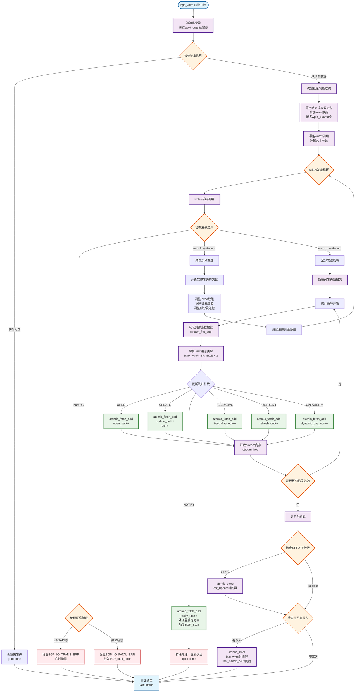

```mermaid
flowchart TD
    Start([bgp_write 函数开始]) --> Init[初始化变量<br/>获取wpkt_quanta配额]
    
    Init --> CheckQueue{检查输出队列}
    CheckQueue -->|队列为空| EmptyQueue[无数据发送<br/>goto done]
    CheckQueue -->|队列有数据| BuildIOV[构建批量发送结构]
    
    BuildIOV --> ExtractPkts[遍历队列提取数据包<br/>构建iovec数组<br/>最多wpkt_quanta个]
    ExtractPkts --> PrepareWrite[准备writev调用<br/>计算总字节数]
    
    PrepareWrite --> WriteLoop{writev发送循环}
    
    WriteLoop --> WritevCall[writev系统调用]
    WritevCall --> CheckResult{检查发送结果}
    
    CheckResult -->|num < 0| HandleError{处理网络错误}
    CheckResult -->|num != writenum| PartialSend[处理部分发送]
    CheckResult -->|num == writenum| FullSend[全部发送成功]
    
    HandleError -->|EAGAIN等| TransErr[设置BGP_IO_TRANS_ERR<br/>临时错误]
    HandleError -->|致命错误| FatalErr[设置BGP_IO_FATAL_ERR<br/>触发TCP_fatal_error]
    
    PartialSend --> CalcSent[计算完整发送的包数]
    CalcSent --> AdjustIOV[调整iovec数组<br/>移除已发送包<br/>调整部分发送包]
    AdjustIOV --> ContinueLoop[继续发送剩余数据]
    ContinueLoop --> WriteLoop
    
    FullSend --> ProcessSent[处理已发送数据包]
    ProcessSent --> StatsLoop[统计循环开始]
    
    StatsLoop --> PopPacket[从队列弹出数据包<br/>stream_fifo_pop]
    PopPacket --> ParseType[解析BGP消息类型<br/>BGP_MARKER_SIZE + 2]
    ParseType --> UpdateStats{更新统计计数}
    
    UpdateStats -->|OPEN| StatOpen[atomic_fetch_add<br/>open_out++]
    UpdateStats -->|UPDATE| StatUpdate[atomic_fetch_add<br/>update_out++<br/>uo++]
    UpdateStats -->|NOTIFY| StatNotify[atomic_fetch_add<br/>notify_out++<br/>处理重启定时器<br/>触发BGP_Stop]
    UpdateStats -->|KEEPALIVE| StatKeepalive[atomic_fetch_add<br/>keepalive_out++]
    UpdateStats -->|REFRESH| StatRefresh[atomic_fetch_add<br/>refresh_out++]
    UpdateStats -->|CAPABILITY| StatCapability[atomic_fetch_add<br/>dynamic_cap_out++]
    
    StatOpen --> FreePacket[释放stream内存<br/>stream_free]
    StatUpdate --> FreePacket
    StatNotify --> NotifyExit[特殊处理：立即退出<br/>goto done]
    StatKeepalive --> FreePacket
    StatRefresh --> FreePacket
    StatCapability --> FreePacket
    
    FreePacket --> NextPacket{是否还有已发送包}
    NextPacket -->|是| StatsLoop
    NextPacket -->|否| UpdateTime[更新时间戳]
    
    UpdateTime --> CheckUO{检查UPDATE计数}
    CheckUO -->|uo > 0| UpdateLastUpdate[atomic_store<br/>last_update时间戳]
    CheckUO -->|uo == 0| CheckWrite{检查是否有写入}
    
    UpdateLastUpdate --> CheckWrite
    CheckWrite -->|有写入| UpdateLastWrite[atomic_store<br/>last_write时间戳<br/>last_sendq_ok时间戳]
    CheckWrite -->|无写入| Done
    
    UpdateLastWrite --> Done[函数结束<br/>返回status]
    EmptyQueue --> Done
    TransErr --> Done
    FatalErr --> Done
    NotifyExit --> Done
    
    %% 样式定义
    classDef startEnd fill:#e1f5fe,stroke:#01579b,stroke-width:2px
    classDef process fill:#f3e5f5,stroke:#4a148c,stroke-width:2px
    classDef decision fill:#fff3e0,stroke:#e65100,stroke-width:2px
    classDef error fill:#ffebee,stroke:#c62828,stroke-width:2px
    classDef stats fill:#e8f5e8,stroke:#2e7d32,stroke-width:2px
    
    class Start,Done startEnd
    class Init,BuildIOV,ExtractPkts,PrepareWrite,WritevCall,ProcessSent,PopPacket,ParseType,FreePacket,UpdateTime,UpdateLastUpdate,UpdateLastWrite process
    class CheckQueue,WriteLoop,CheckResult,HandleError,CheckUO,CheckWrite,NextPacket decision
    class TransErr,FatalErr,NotifyExit error
    class StatOpen,StatUpdate,StatNotify,StatKeepalive,StatRefresh,StatCapability stats
```
