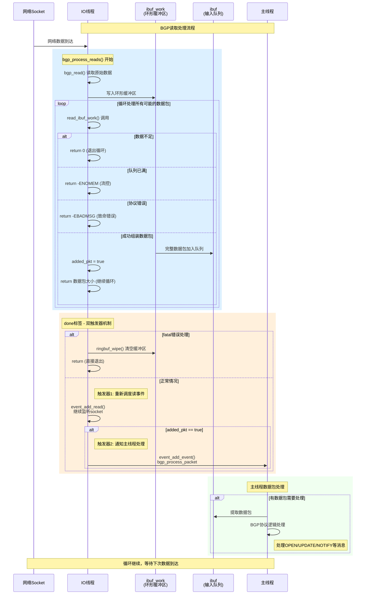

```mermaid
sequenceDiagram
    participant Socket as 网络Socket
    participant IOThread as IO线程
    participant WorkBuf as ibuf_work<br/>(环形缓冲区)
    participant InputQueue as ibuf<br/>(输入队列)
    participant MainThread as 主线程
    
    Note over IOThread,MainThread: BGP读取处理流程
    
    Socket->>IOThread: 网络数据到达
    
    rect rgb(220, 240, 255)
    Note over IOThread: bgp_process_reads() 开始
    IOThread->>IOThread: bgp_read() 读取原始数据
    IOThread->>WorkBuf: 写入环形缓冲区
    
    loop 循环处理所有可能的数据包
        IOThread->>IOThread: read_ibuf_work() 调用
        
        alt 数据不足
            IOThread->>IOThread: return 0 (退出循环)
        else 队列已满
            IOThread->>IOThread: return -ENOMEM (流控)
        else 协议错误
            IOThread->>IOThread: return -EBADMSG (致命错误)
        else 成功组装数据包
            WorkBuf->>InputQueue: 完整数据包加入队列
            IOThread->>IOThread: added_pkt = true
            IOThread->>IOThread: return 数据包大小 (继续循环)
        end
    end
    end
    
    rect rgb(255, 240, 220)
    Note over IOThread: done标签 - 双触发器机制
    
    alt fatal错误处理
        IOThread->>WorkBuf: ringbuf_wipe() 清空缓冲区
        IOThread->>IOThread: return (直接退出)
    else 正常情况
        Note right of IOThread: 触发器1: 重新调度读事件
        IOThread->>IOThread: event_add_read()<br/>继续监听socket
        
        alt added_pkt == true
            Note right of IOThread: 触发器2: 通知主线程处理
            IOThread->>MainThread: event_add_event()<br/>bgp_process_packet
        end
    end
    end
    
    rect rgb(240, 255, 240)
    Note over MainThread: 主线程数据包处理
    alt 有数据包需要处理
        MainThread->>InputQueue: 提取数据包
        MainThread->>MainThread: BGP协议逻辑处理
        Note right of MainThread: 处理OPEN/UPDATE/NOTIFY等消息
    end
    end
    
    Note over Socket,MainThread: 循环继续，等待下次数据到达
```
