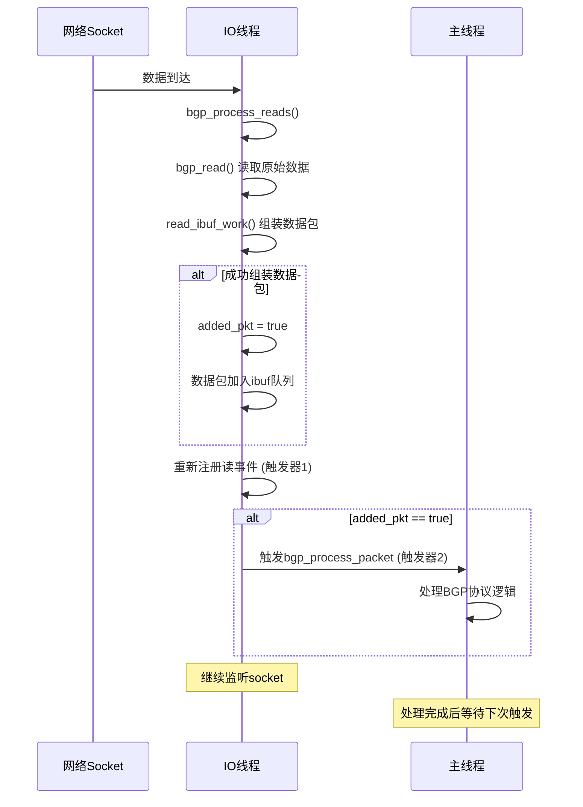

# BGP读取处理流程中的双触发器机制分析

## 1. read_ibuf_work 函数概述

`read_ibuf_work` 函数是BGP IO处理中的核心函数，负责从环形缓冲区(`ibuf_work`)中提取完整的BGP数据包并放入输入队列(`ibuf`)。

### 函数工作流程：
```c
static int read_ibuf_work(struct peer_connection *connection)
{
    // 1. 检查输入队列是否已满
    if (connection->ibuf->count >= bm->inq_limit)
        return -ENOMEM;
    
    // 2. 检查是否有足够数据构成BGP头部
    if (ringbuf_remain(ibw) < BGP_HEADER_SIZE)
        return 0;
    
    // 3. 验证BGP头部有效性
    if (!validate_header(connection))
        return -EBADMSG;
    
    // 4. 获取数据包大小
    ringbuf_peek(ibw, BGP_MARKER_SIZE, &pktsize, sizeof(pktsize));
    
    // 5. 检查是否有完整数据包
    if (ringbuf_remain(ibw) < pktsize)
        return 0;
    
    // 6. 提取完整数据包并加入输入队列
    pkt = stream_new(pktsize);
    ringbuf_get(ibw, pkt->data, pktsize);
    stream_fifo_push(connection->ibuf, pkt);
    
    return pktsize;  // 返回处理的字节数
}
```

## 2. bgp_process_reads 中的调用逻辑

在 `bgp_process_reads` 函数中，`read_ibuf_work` 被循环调用：

```c
while (true) {
    ret = read_ibuf_work(connection);
    if (ret <= 0)
        break;
    
    added_pkt = true;  // 标记已添加数据包
}
```

### 返回值含义：
- **正值**: 成功处理的数据包字节数
- **0**: 数据不足，无法形成完整数据包
- **-ENOMEM**: 输入队列已满
- **-EBADMSG**: 协议错误(无效头部)

## 3. done 标签后的双触发器机制

```c
done:
    /* handle invalid header */
    if (fatal) {
        /* wipe buffer just in case someone screwed up */
        ringbuf_wipe(connection->ibuf_work);
        return;
    }

    // 触发器1: 重新调度读事件
    event_add_read(fpt->master, bgp_process_reads, connection,
                   connection->fd, &connection->t_read);
    
    // 触发器2: 触发主线程数据包处理
    if (added_pkt)
        event_add_event(bm->master, bgp_process_packet, connection, 0,
                        &connection->t_process_packet);
```

## 4. 双触发器的详细分析

### 4.1 触发器1: 读事件重新调度
```c
event_add_read(fpt->master, bgp_process_reads, connection,
               connection->fd, &connection->t_read);
```

**作用**: 在IO线程的事件循环中重新注册读事件监听

**触发条件**: 每次 `bgp_process_reads` 函数执行完毕后都会执行

**目的**:
- **持续监听**: 确保socket上有新数据到达时能及时处理
- **非阻塞处理**: 当前没有数据或数据不完整时，不会阻塞线程
- **事件驱动**: 只有当socket真正可读时才会被调度执行

**重要性**: 如果不重新注册，socket上后续的数据将永远不会被处理

### 4.2 触发器2: 主线程数据包处理
```c
if (added_pkt)
    event_add_event(bm->master, bgp_process_packet, connection, 0,
                    &connection->t_process_packet);
```

**作用**: 通知主线程有新的完整数据包可以处理

**触发条件**: 只有当 `added_pkt = true` 时才触发（即成功提取了至少一个完整数据包）

**目的**:
- **线程解耦**: IO线程只负责数据读取和组包，协议处理交给主线程
- **异步处理**: 不阻塞IO线程，提高并发性能
- **批量处理**: 主线程可以一次处理多个数据包

## 5. 为什么需要两个触发器？

### 5.1 职责分离
- **IO线程**: 专注网络数据读取和数据包组装
- **主线程**: 专注BGP协议逻辑处理

### 5.2 不同的触发条件
- **读事件**: 总是需要重新注册，保证持续监听
- **处理事件**: 只在有新数据包时才需要触发

### 5.3 性能优化
- **避免无效调度**: 没有新数据包时不触发主线程处理
- **及时响应**: 有新数据包时立即通知主线程
- **资源效率**: 减少不必要的上下文切换

## 6. 执行时序图



## 7. 错误处理场景

### 7.1 致命错误 (fatal = true)
- **清理缓冲区**: `ringbuf_wipe(connection->ibuf_work)`
- **不重新调度**: 直接返回，停止后续处理
- **触发错误处理**: 在错误发生时已经调度了错误处理事件

### 7.2 临时错误 (BGP_IO_TRANS_ERR)
- **保持状态**: 不清理缓冲区
- **重新调度**: 继续监听socket，等待下次数据到达
- **不触发处理**: `added_pkt` 保持false

### 7.3 队列满 (-ENOMEM)
- **流量控制**: 暂时停止接收新数据包
- **保持监听**: 仍然重新注册读事件
- **等待消费**: 等待主线程消费现有数据包

## 8. 设计优势

1. **高效的事件驱动**: 只在必要时触发处理
2. **线程安全**: IO和协议处理分离，减少锁竞争
3. **资源优化**: 避免不必要的CPU消耗
4. **可扩展性**: 支持高并发连接处理
5. **错误隔离**: 不同类型错误有不同的处理策略

这种双触发器机制是BGP高性能实现的关键设计，确保了数据处理的及时性和系统资源的高效利用。
