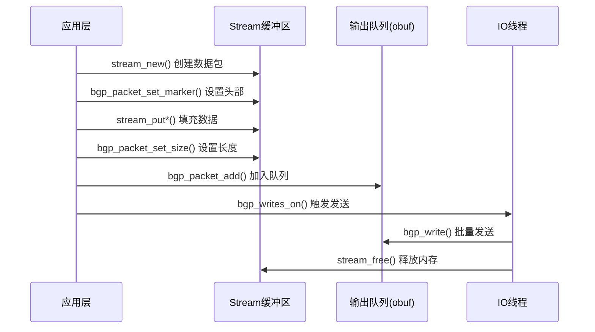

# BGP自定义数据写入函数调用指南

## 1. 核心写入流程概述

要自定义写入特殊数据到BGP连接，你需要遵循以下核心流程：

```
1. 创建stream数据包
2. 填充数据内容
3. 设置BGP包头
4. 添加到输出队列
5. 触发写入事件
```

## 2. 必须手动调用的关键函数

### 2.1 数据包创建和格式化

#### **stream_new()** - 创建数据包
```c
struct stream *s = stream_new(BGP_STANDARD_MESSAGE_MAX_PACKET_SIZE);
```
- **作用**: 分配新的数据包内存
- **参数**: 数据包最大大小
- **返回**: stream指针

#### **bgp_packet_set_marker()** - 设置BGP标准头部
```c
int bgp_packet_set_marker(struct stream *s, uint8_t type);
```
- **作用**: 设置BGP协议标准的marker和消息类型
- **参数**: 
  - `s`: stream指针
  - `type`: BGP消息类型（BGP_MSG_OPEN, BGP_MSG_UPDATE等）
- **包含**: 16字节0xFF marker + 2字节长度占位符 + 1字节类型

#### **bgp_packet_set_size()** - 设置数据包长度
```c
int bgp_packet_set_size(struct stream *s);
```
- **作用**: 计算并填充BGP头部的长度字段
- **调用时机**: 在完成所有数据填充后调用

### 2.2 数据写入函数

#### **stream_putc()** - 写入单字节
```c
int stream_putc(struct stream *s, uint8_t c);
```

#### **stream_putw()** - 写入双字节（网络字节序）
```c
int stream_putw(struct stream *s, uint16_t w);
```

#### **stream_putl()** - 写入四字节（网络字节序）
```c
int stream_putl(struct stream *s, uint32_t l);
```

#### **stream_put()** - 写入任意数据块
```c
int stream_put(struct stream *s, const void *src, size_t size);
```

### 2.3 队列操作和发送触发

#### **bgp_packet_add()** - 添加数据包到输出队列
```c
void bgp_packet_add(struct peer_connection *connection, struct peer *peer, struct stream *s);
```
- **作用**: 将数据包安全地添加到输出队列
- **包含**: 互斥锁保护、时间戳更新、发送队列管理
- **关键**: 这个函数会调用 `stream_fifo_push(connection->obuf, s)`

#### **bgp_writes_on()** - 触发写入事件
```c
void bgp_writes_on(struct peer_connection *connection);
```
- **作用**: 在IO线程中注册写事件，触发数据包发送
- **调用时机**: 添加数据包到队列后必须调用

## 3. 完整的自定义数据写入模板

### 3.1 基本模板
```c
void send_custom_bgp_data(struct peer_connection *connection, 
                         uint8_t msg_type, 
                         const void *data, 
                         size_t data_len)
{
    struct peer *peer = connection->peer;
    struct stream *s;
    
    // 1. 创建数据包
    s = stream_new(BGP_STANDARD_MESSAGE_MAX_PACKET_SIZE);
    if (!s) {
        flog_err(EC_BGP_PKT_PROCESS, "Failed to allocate stream");
        return;
    }
    
    // 2. 设置BGP头部（marker + 长度占位符 + 类型）
    bgp_packet_set_marker(s, msg_type);
    
    // 3. 添加自定义数据
    if (data && data_len > 0) {
        stream_put(s, data, data_len);
    }
    
    // 4. 设置正确的数据包长度
    bgp_packet_set_size(s);
    
    // 5. 添加到输出队列并触发发送
    bgp_packet_add(connection, peer, s);
    bgp_writes_on(connection);
}
```

### 3.2 扩展模板（带错误处理）
```c
int send_custom_bgp_message(struct peer_connection *connection,
                           uint8_t msg_type,
                           const void *payload,
                           size_t payload_len)
{
    struct peer *peer = connection->peer;
    struct stream *s;
    
    // 检查连接状态
    if (!peer_established(connection)) {
        flog_warn(BGP_WARN_PKT_SEND, 
                 "%s: Cannot send packet, peer not established", 
                 peer->host);
        return -1;
    }
    
    // 检查输出队列是否已满
    if (connection->obuf->count >= bm->outq_limit) {
        flog_warn(BGP_WARN_PKT_SEND,
                 "%s: Output queue full, dropping packet",
                 peer->host);
        return -1;
    }
    
    // 创建数据包
    s = stream_new(BGP_EXTENDED_MESSAGE_MAX_PACKET_SIZE);
    if (!s) {
        flog_err(EC_BGP_PKT_PROCESS, 
                "%s: Failed to allocate stream", peer->host);
        return -1;
    }
    
    // 设置BGP标准头部
    bgp_packet_set_marker(s, msg_type);
    
    // 添加自定义载荷
    if (payload && payload_len > 0) {
        // 检查数据包大小限制
        if (BGP_HEADER_SIZE + payload_len > peer->max_packet_size) {
            flog_err(EC_BGP_PKT_PROCESS,
                    "%s: Packet too large (%zu bytes)",
                    peer->host, BGP_HEADER_SIZE + payload_len);
            stream_free(s);
            return -1;
        }
        
        stream_put(s, payload, payload_len);
    }
    
    // 设置数据包长度
    bgp_packet_set_size(s);
    
    // 调试输出
    if (bgp_debug_neighbor_events(peer)) {
        zlog_debug("%s: Sending custom BGP message type %d, size %zu",
                  peer->host, msg_type, stream_get_endp(s));
    }
    
    // 添加到输出队列并触发发送
    bgp_packet_add(connection, peer, s);
    bgp_writes_on(connection);
    
    return 0;
}
```

## 4. 特殊场景的函数调用

### 4.1 发送NOTIFY消息
```c
void bgp_notify_send_with_data(struct peer_connection *connection,
                              uint8_t code, uint8_t sub_code,
                              uint8_t *data, size_t datalen);
```

### 4.2 发送KEEPALIVE消息
```c
void bgp_keepalive_send(struct peer *peer);
```

### 4.3 批量发送（如UPDATE消息）
```c
// 在循环中添加多个数据包，最后统一触发
for (int i = 0; i < packet_count; i++) {
    bgp_packet_add(connection, peer, packets[i]);
}
bgp_writes_on(connection);  // 只调用一次
```

## 5. 重要注意事项

### 5.1 线程安全
- `bgp_packet_add()` 内部已经包含互斥锁保护
- 不要直接调用 `stream_fifo_push()`，使用 `bgp_packet_add()`

### 5.2 内存管理
- stream会在发送完成后自动释放（在bgp_write中）
- 发送失败时需要手动释放stream

### 5.3 错误处理
- 检查连接状态：`peer_established(connection)`
- 检查队列状态：`connection->obuf->count < bm->outq_limit`
- 检查数据包大小：不超过 `peer->max_packet_size`

### 5.4 性能考虑
- 批量发送时，最后统一调用 `bgp_writes_on()`
- 避免频繁的小数据包发送
- 考虑使用 `wpkt_quanta` 控制批量大小

## 6. 调用序列图



## 7. 示例：发送自定义能力协商消息

```c
int send_custom_capability(struct peer_connection *connection, 
                          uint8_t cap_code, 
                          const uint8_t *cap_value, 
                          uint8_t cap_len)
{
    struct stream *s;
    
    s = stream_new(BGP_STANDARD_MESSAGE_MAX_PACKET_SIZE);
    if (!s) return -1;
    
    // BGP头部
    bgp_packet_set_marker(s, BGP_MSG_CAPABILITY);
    
    // 能力协商格式：代码(1) + 长度(1) + 值(变长)
    stream_putc(s, cap_code);
    stream_putc(s, cap_len);
    if (cap_len > 0 && cap_value) {
        stream_put(s, cap_value, cap_len);
    }
    
    bgp_packet_set_size(s);
    bgp_packet_add(connection, connection->peer, s);
    bgp_writes_on(connection);
    
    return 0;
}
```

## 8. 直接Socket FD写入（高级用法）

### 8.1 直接访问socket文件描述符

在某些场景下，你可能需要绕过BGP协议栈直接向socket写入数据。这种方法提供了最大的灵活性，但也需要处理更多的底层细节。

#### 获取socket fd
```c
int get_bgp_socket_fd(struct peer_connection *connection)
{
    if (!connection || connection->fd <= 0) {
        return -1;
    }
    
    // 检查连接状态
    if (connection->status != Established) {
        flog_warn(BGP_WARN_PKT_SEND, 
                 "Connection not established, fd=%d", connection->fd);
        return -1;
    }
    
    return connection->fd;
}
```

### 8.2 直接写入函数模板

#### 基本写入
```c
ssize_t direct_socket_write(struct peer_connection *connection, 
                           const void *data, 
                           size_t len)
{
    int fd = get_bgp_socket_fd(connection);
    if (fd < 0) {
        return -1;
    }
    
    // 直接写入socket
    ssize_t written = write(fd, data, len);
    
    if (written < 0) {
        if (errno == EAGAIN || errno == EWOULDBLOCK) {
            // 非阻塞socket，缓冲区满，需要稍后重试
            return 0;
        } else {
            // 其他错误
            flog_err(EC_BGP_PKT_PROCESS, 
                    "Socket write error: %s", safe_strerror(errno));
            return -1;
        }
    } else if (written < (ssize_t)len) {
        // 部分写入，需要继续写入剩余数据
        flog_debug("Partial write: %zd/%zu bytes", written, len);
    }
    
    return written;
}
```

#### 批量写入（writev）
```c
ssize_t direct_writev_write(struct peer_connection *connection,
                           const struct iovec *iov,
                           int iovcnt)
{
    int fd = get_bgp_socket_fd(connection);
    if (fd < 0) {
        return -1;
    }
    
    // 使用writev批量写入（与bgp_write内部机制相同）
    ssize_t written = writev(fd, iov, iovcnt);
    
    if (written < 0) {
        if (errno == EAGAIN || errno == EWOULDBLOCK) {
            return 0;  // 需要稍后重试
        }
        flog_err(EC_BGP_PKT_PROCESS, 
                "writev error: %s", safe_strerror(errno));
        return -1;
    }
    
    return written;
}
```

### 8.3 FRR内部socket写入机制分析

BGP内部使用的写入机制（位于bgp_io.c中的bgp_write函数）：

```c
// BGP内部写入流程概览
static uint16_t bgp_write(struct peer_connection *connection)
{
    // 1. 从输出队列获取待发送的stream
    struct stream *s = stream_fifo_head(connection->obuf);
    
    // 2. 准备批量发送的iovec数组
    struct iovec iov[wpkt_quanta_old];
    while (count < wpkt_quanta_old && s) {
        iov[iovsz].iov_base = stream_pnt(s);    // 数据指针
        iov[iovsz].iov_len = STREAM_READABLE(s); // 数据长度
        s = s->next;
        ++iovsz;
    }
    
    // 3. 使用writev批量写入socket
    num = writev(connection->fd, iov, iovsz);
    
    // 4. 处理写入结果和统计
    // 5. 清理已发送的stream
}
```

### 8.4 绕过队列的原始数据写入

```c
int send_raw_data_bypass_queue(struct peer_connection *connection,
                              const void *raw_data,
                              size_t data_len)
{
    // 检查连接状态
    if (!peer_established(connection)) {
        return -1;
    }
    
    // 直接写入，不经过BGP协议处理
    ssize_t written = direct_socket_write(connection, raw_data, data_len);
    
    if (written > 0) {
        // 可选：更新最后写入时间（如果需要保持统计一致性）
        struct peer *peer = connection->peer;
        atomic_store_explicit(&peer->last_write, monotime(NULL),
                             memory_order_relaxed);
    }
    
    return written;
}
```

### 8.5 关键考虑因素

#### 线程安全
```c
// BGP IO在独立线程中运行
// 直接socket写入时要注意线程同步
// connection->fd的访问是线程安全的，但要确保连接状态检查
```

#### 非阻塞IO处理
```c
// FRR使用非阻塞socket
// 需要正确处理EAGAIN/EWOULDBLOCK
void handle_write_would_block(struct peer_connection *connection)
{
    // 可以选择：
    // 1. 立即返回，让调用者稍后重试
    // 2. 注册写事件等待socket可写
    struct frr_pthread *fpt = bgp_pth_io;
    event_add_write(fpt->master, bgp_process_writes, connection,
                   connection->fd, &connection->t_write);
}
```

#### 与协议栈的协调
```c
// 如果混用直接写入和协议栈写入，需要注意：
// 1. 数据包顺序可能被打乱
// 2. 统计信息可能不准确
// 3. 协议状态可能不一致

// 建议的混合使用模式：
int mixed_write_example(struct peer_connection *connection)
{
    // 先发送紧急数据（直接写入）
    uint8_t urgent_data[] = {0xFF, 0xFF, 0x00, 0x10}; // 示例数据
    direct_socket_write(connection, urgent_data, sizeof(urgent_data));
    
    // 然后发送标准BGP消息（通过协议栈）
    struct stream *s = stream_new(BGP_STANDARD_MESSAGE_MAX_PACKET_SIZE);
    bgp_packet_set_marker(s, BGP_MSG_KEEPALIVE);
    bgp_packet_set_size(s);
    bgp_packet_add(connection, connection->peer, s);
    bgp_writes_on(connection);
    
    return 0;
}
```

### 8.6 性能优化

#### 批量直接写入
```c
int send_multiple_raw_packets(struct peer_connection *connection,
                             struct raw_packet *packets,
                             int count)
{
    struct iovec iov[count];
    
    // 准备批量写入
    for (int i = 0; i < count; i++) {
        iov[i].iov_base = packets[i].data;
        iov[i].iov_len = packets[i].len;
    }
    
    // 批量写入（类似BGP内部的批量机制）
    return direct_writev_write(connection, iov, count);
}
```

### 8.7 调试和监控

```c
void debug_socket_write(struct peer_connection *connection, 
                       const void *data, size_t len)
{
    struct peer *peer = connection->peer;
    
    if (bgp_debug_neighbor_events(peer)) {
        zlog_debug("%s: Direct socket write %zu bytes to fd=%d",
                  peer->host, len, connection->fd);
        
        // 可选：十六进制转储前几个字节
        if (len > 0 && bgp_debug_verbose) {
            char hex_dump[64];
            size_t dump_len = len > 16 ? 16 : len;
            for (size_t i = 0; i < dump_len; i++) {
                snprintf(hex_dump + i*3, 4, "%02x ", ((uint8_t*)data)[i]);
            }
            zlog_debug("%s: Data dump: %s", peer->host, hex_dump);
        }
    }
}
```

### 8.8 注意事项

1. **协议一致性**：直接写入可能破坏BGP协议状态
2. **统计准确性**：需要手动更新相关统计计数器
3. **错误处理**：必须妥善处理网络错误和连接状态变化
4. **调试难度**：绕过协议栈增加了问题定位的复杂性
5. **移植性**：直接socket操作可能影响代码的移植性

### 8.9 推荐使用场景

- **性能关键场景**：需要最小延迟的数据传输
- **协议扩展**：发送非标准BGP数据
- **调试和测试**：注入特殊测试数据
- **紧急控制**：需要立即发送的控制信息

通过直接socket写入，你可以获得最大的控制权，但请谨慎使用，确保不会影响BGP协议的正常运行。
