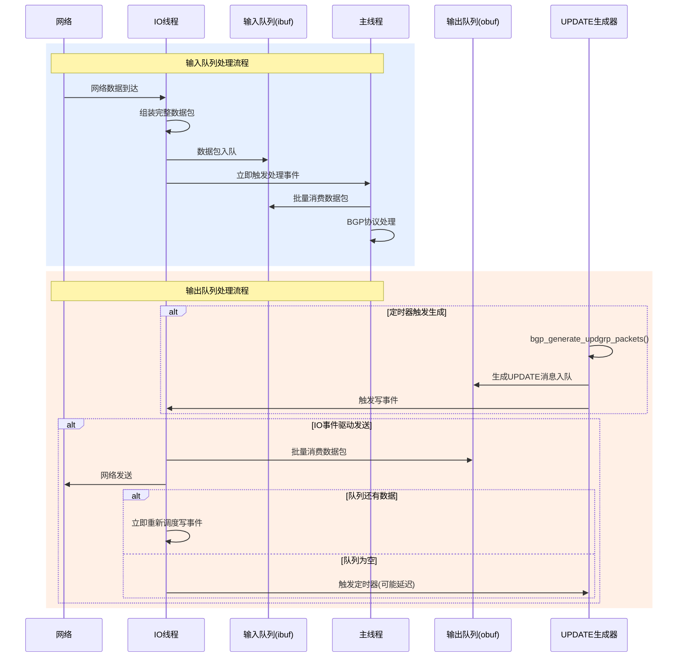

# BGP队列消费机制深度分析

## 1. 队列消费机制总览

BGP的输入队列(`ibuf`)和输出队列(`obuf`)采用了**不同的消费策略**，并非都是定时器驱动：

- **输入队列(`ibuf`)**: **事件驱动消费** - 立即处理
- **输出队列(`obuf`)**: **混合机制** - 事件驱动 + 定时器优化

## 2. 输入队列(`ibuf`)消费机制

### 2.1 事件驱动的即时消费
```c
// 在 bgp_process_reads() 中
if (added_pkt)
    event_add_event(bm->master, bgp_process_packet, connection, 0,
                    &connection->t_process_packet);
```

**特点**:
- **即时触发**: 有新数据包立即通知主线程处理
- **无延迟**: 使用 `event_add_event()` 而非定时器
- **批量处理**: 主线程一次可处理多个数据包

### 2.2 批量消费逻辑
```c
void bgp_process_packet(struct event *thread)
{
    uint32_t rpkt_quanta_old = atomic_load_explicit(&peer->bgp->rpkt_quanta,
                                                   memory_order_relaxed);
    
    while (processed < rpkt_quanta_old) {
        frr_with_mutex(&connection->io_mtx) {
            peer->curr = stream_fifo_pop(connection->ibuf);  // 从队列消费
        }
        
        if (peer->curr == NULL)
            return;  // 队列为空，处理完毕
        
        // 根据消息类型处理
        switch (type) {
            case BGP_MSG_OPEN: bgp_open_receive(...); break;
            case BGP_MSG_UPDATE: bgp_update_receive(...); break;
            // ...
        }
        processed++;
    }
}
```

## 3. 输出队列(`obuf`)消费机制

### 3.1 双重触发机制

#### 机制1: IO事件驱动（主要机制）
```c
// 在 bgp_process_writes() 中
frr_with_mutex(&connection->io_mtx) {
    status = bgp_write(connection);  // 直接从obuf消费并发送
    reschedule = (stream_fifo_head(connection->obuf) != NULL);
}

if (reschedule) {
    // 队列还有数据，立即重新调度写事件
    event_add_write(fpt->master, bgp_process_writes, connection,
                    connection->fd, &connection->t_write);
}
```

#### 机制2: 定时器优化（辅助机制）
```c
// 当IO事件完成且队列为空时
if (!reschedule && !fatal) {
    BGP_UPDATE_GROUP_TIMER_ON(&connection->t_generate_updgrp_packets,
                              bgp_generate_updgrp_packets);
}
```

### 3.2 定时器宏定义分析
```c
#define BGP_UPDATE_GROUP_TIMER_ON(T, F)                                               \
    do {                                                                          \
        if (BGP_SUPPRESS_FIB_ENABLED(peer->bgp) &&                            \
            PEER_ROUTE_ADV_DELAY(peer))                                       \
            event_add_timer_msec(bm->master, (F), connection,             \
                                (BGP_DEFAULT_UPDATE_ADVERTISEMENT_TIME * \
                                 1000),                                  \
                                (T));                                    \
        else                                                                  \
            event_add_timer_msec(bm->master, (F), connection, 0,          \
                                (T));                                    \
    } while (0)

#define BGP_DEFAULT_UPDATE_ADVERTISEMENT_TIME  1  // 1秒延迟
```

**触发条件**:
- **有FIB抑制且有路由广告延迟**: 1秒后触发
- **正常情况**: 立即触发（延迟0毫秒）

### 3.3 UPDATE消息生成器
```c
void bgp_generate_updgrp_packets(struct event *thread)
{
    struct peer_connection *connection = EVENT_ARG(thread);
    uint32_t wpq = atomic_load_explicit(&peer->bgp->wpkt_quanta,
                                       memory_order_relaxed);
    
    // 检查输出队列是否已满
    if (connection->obuf->count >= bm->outq_limit) {
        bgp_write_proceed_actions(peer);
        return;
    }
    
    // 生成UPDATE数据包并加入obuf队列
    do {
        // 遍历所有地址族
        for (index = BGP_AF_START; index < BGP_AF_MAX; index++) {
            // 生成withdraw和update消息
            next_pkt = subgroup_withdraw_packet(PAF_SUBGRP(paf));
            if (!next_pkt || !next_pkt->buffer)
                subgroup_update_packet(PAF_SUBGRP(paf), peer);
            
            // 将数据包加入输出队列
            if (pkt_to_send) {
                stream_fifo_push(connection->obuf, pkt_to_send);
                generated++;
            }
        }
    } while (generated < wpq && /* 继续生成直到达到配额 */);
    
    // 如果有数据包生成，触发写事件
    if (generated > 0)
        bgp_writes_on(connection);
}
```

## 4. 消费机制对比分析

| 队列类型 | 消费触发方式 | 延迟特性 | 批量处理 | 流控机制 |
|---------|-------------|---------|---------|---------|
| **输入队列(ibuf)** | 事件驱动 | 无延迟 | rpkt_quanta | inq_limit |
| **输出队列(obuf)** | 事件+定时器 | 可配置延迟 | wpkt_quanta | outq_limit |

### 4.1 输入队列特点
- **实时性优先**: 接收到数据包立即处理
- **简单高效**: 纯事件驱动，无复杂定时逻辑
- **流控严格**: 队列满时直接拒绝新数据

### 4.2 输出队列特点
- **吞吐量优化**: 可批量生成和发送
- **延迟控制**: 支持FIB抑制场景的延迟发送
- **自适应**: 根据网络状况和队列状态调整

## 5. 完整的数据流转时序



## 6. 关键配置参数

### 6.1 队列大小限制
```c
bm->inq_limit    // 输入队列最大深度
bm->outq_limit   // 输出队列最大深度
```

### 6.2 批量处理配额
```c
peer->bgp->rpkt_quanta  // 每次处理的接收数据包数
peer->bgp->wpkt_quanta  // 每次生成的输出数据包数
```

### 6.3 延迟控制
```c
BGP_DEFAULT_UPDATE_ADVERTISEMENT_TIME  // 1秒
BGP_SUPPRESS_FIB_ENABLED()            // FIB抑制开关
PEER_ROUTE_ADV_DELAY()               // 路由广告延迟
```

## 7. 性能优化策略

### 7.1 输入队列优化
- **零延迟处理**: 确保协议响应的实时性
- **批量消费**: 减少上下文切换开销
- **严格流控**: 防止内存耗尽

### 7.2 输出队列优化
- **智能调度**: 根据网络状况调整发送策略
- **批量生成**: 提高UPDATE消息的生成效率
- **延迟控制**: 支持FIB抑制等高级特性

## 8. 总结

**你的理解需要修正**：

❌ **错误理解**: 输入输出队列都有定时器定时消费
✅ **正确理解**: 
- **输入队列**: 纯事件驱动，立即消费
- **输出队列**: 事件驱动为主，定时器辅助优化

这种设计确保了：
1. **接收路径的实时性** - 协议消息能够及时处理
2. **发送路径的效率** - 支持批量发送和延迟控制
3. **系统的稳定性** - 通过流控防止队列溢出
4. **功能的完整性** - 支持各种BGP特性需求

BGP的这种异步队列设计是高性能路由协议实现的典型模式。
