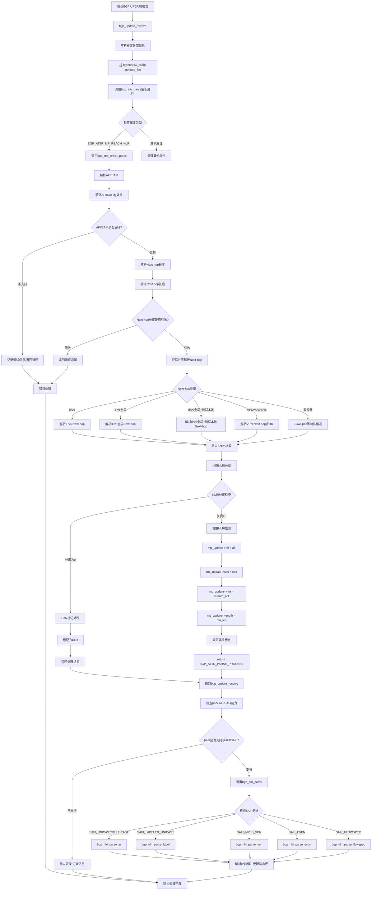

# FRR BGP模块中MP_REACH_NLRI处理流程分析

## 概述

本文档详细分析了FRR (Free Range Routing) 中BGP模块对UPDATE报文中MP_REACH_NLRI (Multiprotocol Reachable NLRI) 属性的处理流程。MP_REACH_NLRI是BGP-4多协议扩展中的重要属性，用于承载不同地址族的可达路由信息。

## MP_REACH_NLRI处理流程



## 详细流程说明

### 1. UPDATE报文接收 (bgp_update_receive)

当BGP收到UPDATE报文时，首先进行基本的报文解析：
- 提取withdraw长度和属性长度
- 验证报文格式的有效性
- 准备进入属性解析阶段

### 2. 属性解析 (bgp_attr_parse)

在属性解析阶段，系统会遍历所有BGP属性：
```c
case BGP_ATTR_MP_REACH_NLRI:
    ret = bgp_mp_reach_parse(&attr_args, mp_update);
    break;
```

### 3. MP_REACH_NLRI解析 (bgp_mp_reach_parse)

这是核心处理函数，主要步骤包括：

#### 3.1 AFI/SAFI解析
```c
pkt_afi = stream_getw(s);    // 读取2字节AFI
pkt_safi = stream_getc(s);   // 读取1字节SAFI

// 转换为内部格式并验证
if (bgp_map_afi_safi_iana2int(pkt_afi, pkt_safi, &afi, &safi)) {
    // 不支持的AFI/SAFI
    return BGP_ATTR_PARSE_ERROR;
}
```

#### 3.2 Next-hop解析
Next-hop的解析根据长度字段进行不同处理：

- **长度为0**: FlowSpec等特殊SAFI
- **长度为4**: IPv4 Next-hop
- **长度为12**: VPNv4 Next-hop (8字节RD + 4字节IPv4)
- **长度为16**: IPv6全局Next-hop
- **长度为24**: VPNv6全局Next-hop (8字节RD + 16字节IPv6)
- **长度为32**: IPv6全局+链路本地Next-hop
- **长度为48**: VPNv6全局+链路本地Next-hop

#### 3.3 SNPA处理
```c
uint8_t val;
if ((val = stream_getc(s)))
    flog_warn(EC_BGP_DEFUNCT_SNPA_LEN,
              "%s sent non-zero value, %u, for defunct SNPA-length field",
              peer->host, val);
```

#### 3.4 NLRI数据设置
```c
mp_update->afi = afi;
mp_update->safi = safi;
mp_update->nlri = stream_pnt(s);
mp_update->length = nlri_len;
```

### 4. NLRI处理 (bgp_nlri_parse)

根据SAFI类型分派到不同的解析器：

- **SAFI_UNICAST/MULTICAST**: 标准IP路由
- **SAFI_LABELED_UNICAST**: 带标签的单播路由
- **SAFI_MPLS_VPN**: MPLS VPN路由
- **SAFI_EVPN**: EVPN路由
- **SAFI_FLOWSPEC**: FlowSpec规则

### 5. 错误处理

系统在多个层面进行错误检查：
- 报文长度验证
- AFI/SAFI支持检查
- Next-hop长度验证
- Peer能力检查

## 关键数据结构

### bgp_nlri结构
```c
struct bgp_nlri {
    afi_t afi;          // 地址族标识符
    safi_t safi;        // 子地址族标识符
    uint8_t *nlri;      // NLRI数据指针
    bgp_size_t length;  // NLRI数据长度
};
```

### 属性解析参数
```c
struct bgp_attr_parser_args {
    struct peer *peer;
    struct attr *attr;
    bgp_size_t length;
    uint8_t type;
    uint8_t flags;
    uint8_t *startp;
};
```

## EoR (End of RIB) 处理

当NLRI长度为0时，被识别为EoR标记：
```c
if (!nlri_len) {
    zlog_info("%s: %s sent a zero-length NLRI. Hence, treating as a EOR marker",
              __func__, peer->host);
    mp_update->afi = afi;
    mp_update->safi = safi;
    return bgp_attr_malformed(args, BGP_NOTIFY_UPDATE_MAL_ATTR, 0);
}
```

## 总结

FRR中MP_REACH_NLRI的处理是一个多层次的过程，从报文接收、属性解析、到最终的路由处理，每个阶段都有完善的错误检查和处理机制。这种设计确保了BGP多协议扩展的稳定性和可靠性。

整个流程体现了模块化设计的优势，不同的SAFI有专门的处理器，便于维护和扩展新的地址族支持。
