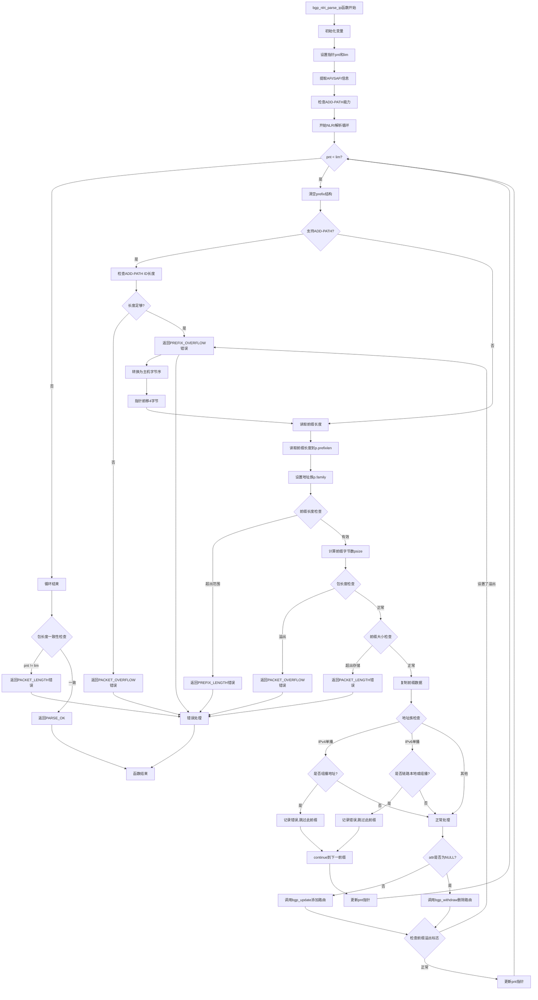

# FRR BGP bgp_nlri_parse_ip函数详细分析

## 概述

`bgp_nlri_parse_ip`函数是FRR BGP模块中处理IP地址族NLRI (Network Layer Reachability Information)的核心函数。该函数负责解析IPv4和IPv6的单播/组播路由信息，包括ADD-PATH支持和各种错误检查。

## 函数处理流程图



## 详细代码分析

### 1. 函数声明和参数

```c
int bgp_nlri_parse_ip(struct peer *peer, struct attr *attr,
                      struct bgp_nlri *packet)
```

**参数说明:**
- `peer`: BGP对等体指针
- `attr`: 路径属性指针 (NULL表示withdraw操作)
- `packet`: NLRI数据包结构

### 2. 变量初始化

```c
uint8_t *pnt;          // 当前解析位置指针
uint8_t *lim;          // 数据包结束位置
struct prefix p;       // 前缀结构
int psize;            // 前缀字节大小
afi_t afi;            // 地址族标识符
safi_t safi;          // 子地址族标识符
bool addpath_capable; // ADD-PATH能力标志
uint32_t addpath_id;  // ADD-PATH标识符
```

### 3. ADD-PATH能力检查

```c
addpath_capable = bgp_addpath_encode_rx(peer, afi, safi);
```

**bgp_addpath_encode_rx函数:**
```c
bool bgp_addpath_encode_rx(struct peer *peer, afi_t afi, safi_t safi)
{
    return (CHECK_FLAG(peer->af_cap[afi][safi], PEER_CAP_ADDPATH_AF_RX_ADV)
            && CHECK_FLAG(peer->af_cap[afi][safi], PEER_CAP_ADDPATH_AF_TX_RCV));
}
```

### 4. NLRI解析循环

#### 4.1 ADD-PATH ID处理

当支持ADD-PATH时:
```c
if (addpath_capable) {
    // 检查是否有足够的字节读取ADD-PATH ID
    if (pnt + BGP_ADDPATH_ID_LEN >= lim)
        return BGP_NLRI_PARSE_ERROR_PACKET_OVERFLOW;
    
    // 读取ADD-PATH ID (4字节)
    memcpy(&addpath_id, pnt, BGP_ADDPATH_ID_LEN);
    addpath_id = ntohl(addpath_id);  // 网络字节序转主机字节序
    pnt += BGP_ADDPATH_ID_LEN;      // 指针前移4字节
}
```

#### 4.2 前缀长度解析

```c
p.prefixlen = *pnt++;        // 读取前缀长度
p.family = afi2family(afi);  // 设置地址族

// 前缀长度有效性检查
if (p.prefixlen > prefix_blen(&p) * 8) {
    // 前缀长度超出该地址族的最大值
    return BGP_NLRI_PARSE_ERROR_PREFIX_LENGTH;
}
```

**prefix_blen函数:**
- IPv4: 返回4 (32位最大前缀长度)
- IPv6: 返回16 (128位最大前缀长度)

#### 4.3 前缀数据解析

```c
psize = PSIZE(p.prefixlen);  // 计算前缀字节数

// PSIZE宏定义: #define PSIZE(a) (((a) + 7) / (8))
// 例如: 前缀长度24位 -> psize = (24+7)/8 = 3字节

// 包溢出检查
if (pnt + psize > lim) {
    return BGP_NLRI_PARSE_ERROR_PACKET_OVERFLOW;
}

// 防御性编程: 确保psize不超过prefix结构的存储空间
if (psize > (ssize_t)sizeof(p.u.val)) {
    return BGP_NLRI_PARSE_ERROR_PACKET_LENGTH;
}

// 复制前缀数据
memcpy(p.u.val, pnt, psize);
```

### 5. 地址有效性检查

#### 5.1 IPv4单播地址检查

```c
if (afi == AFI_IP && safi == SAFI_UNICAST) {
    if (IN_CLASSD(ntohl(p.u.prefix4.s_addr))) {
        // IPv4组播地址 (224.0.0.0/4) 不能用于单播
        flog_err(EC_BGP_UPDATE_RCV,
                "%s: IPv4 unicast NLRI is multicast address %pI4, ignoring",
                peer->host, &p.u.prefix4);
        continue;  // 跳过此前缀，继续处理下一个
    }
}
```

**IN_CLASSD宏:** 检查是否为D类地址(组播地址 224.0.0.0-239.255.255.255)

#### 5.2 IPv6单播地址检查

```c
if (afi == AFI_IP6 && safi == SAFI_UNICAST) {
    // 检查链路本地地址
    if (IN6_IS_ADDR_LINKLOCAL(&p.u.prefix6)) {
        flog_err(EC_BGP_UPDATE_RCV,
                "%s: IPv6 unicast NLRI is link-local address %pI6, ignoring",
                peer->host, &p.u.prefix6);
        continue;
    }
    
    // 检查组播地址
    if (IN6_IS_ADDR_MULTICAST(&p.u.prefix6)) {
        flog_err(EC_BGP_UPDATE_RCV,
                "%s: IPv6 unicast NLRI is multicast address %pI6, ignoring",
                peer->host, &p.u.prefix6);
        continue;
    }
}
```

### 6. 路由更新/撤销处理

```c
if (attr) {
    // 有属性 -> 路由更新
    bgp_update(peer, &p, addpath_id, attr, afi, safi,
               ZEBRA_ROUTE_BGP, BGP_ROUTE_NORMAL, NULL,
               NULL, 0, 0, NULL);
} else {
    // 无属性 -> 路由撤销
    bgp_withdraw(peer, &p, addpath_id, afi, safi,
                 ZEBRA_ROUTE_BGP, BGP_ROUTE_NORMAL, NULL,
                 NULL, 0, NULL);
}
```

### 7. 前缀溢出检查

```c
// 检查是否达到最大前缀数限制
if (CHECK_FLAG(peer->sflags, PEER_STATUS_PREFIX_OVERFLOW))
    return BGP_NLRI_PARSE_ERROR_PREFIX_OVERFLOW;
```

### 8. 包长度一致性检查

```c
// 确保解析了所有数据
if (pnt != lim) {
    flog_err(EC_BGP_UPDATE_RCV,
            "%s [Error] Update packet error (prefix length mismatch with total length)",
            peer->host);
    return BGP_NLRI_PARSE_ERROR_PACKET_LENGTH;
}

return BGP_NLRI_PARSE_OK;  // 解析成功
```

## 关键特性

### 1. ADD-PATH支持
- 支持RFC 7911 ADD-PATH扩展
- 每个前缀可以有唯一的路径标识符
- 允许多路径的传播和选择

### 2. 严格的错误检查
- 包长度溢出检查
- 前缀长度有效性验证
- 地址类型合规性检查
- 前缀数量限制检查

### 3. 地址族兼容性
- 支持IPv4和IPv6
- 支持单播和组播SAFI
- 过滤不合规的地址类型

### 4. 防御性编程
- 多层次的边界检查
- 错误日志记录
- 优雅的错误处理和恢复

## 错误类型

1. **BGP_NLRI_PARSE_ERROR_PACKET_OVERFLOW**: 包数据溢出
2. **BGP_NLRI_PARSE_ERROR_PREFIX_LENGTH**: 前缀长度无效
3. **BGP_NLRI_PARSE_ERROR_PACKET_LENGTH**: 包长度不一致
4. **BGP_NLRI_PARSE_ERROR_PREFIX_OVERFLOW**: 前缀数量超限
5. **BGP_NLRI_PARSE_OK**: 解析成功

## 总结

`bgp_nlri_parse_ip`函数是BGP路由处理的核心组件，体现了以下设计原则：

1. **健壮性**: 多层次的错误检查和边界验证
2. **兼容性**: 支持IPv4/IPv6和ADD-PATH扩展
3. **安全性**: 严格的地址类型验证
4. **性能**: 高效的内存操作和循环处理
5. **可维护性**: 清晰的代码结构和错误处理

该函数确保了BGP路由信息的正确解析和处理，是FRR BGP实现稳定性的重要保障。
