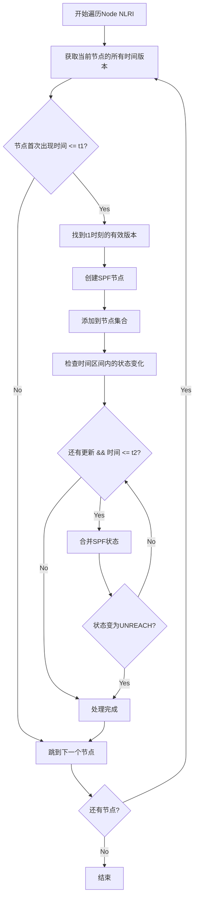
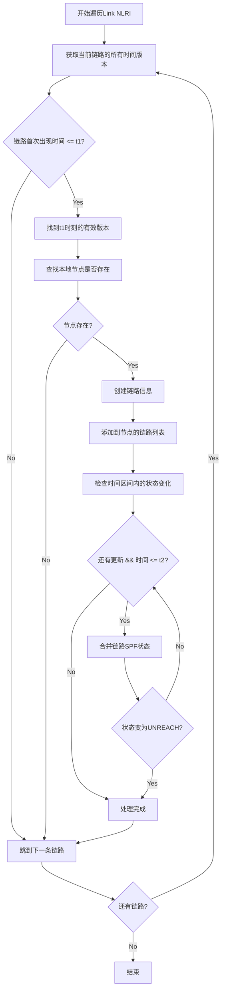
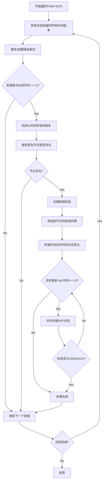

# TVR SPF Build函数逻辑分析

## 概述

`build`函数是TVR SPF模块的核心组件，负责从TVR数据库中提取指定时间区间`[t1, t2]`内有效的网络拓扑信息，并构建用于SPF计算的数据结构。

## Build函数总体流程

```c
static void build(struct tvr_spf *spf, struct tvr_db *db, uint64_t t1, uint64_t t2) {
    build_from_node_nlri(&spf->node_rb_root, &db->nnlri_rb_root, t1, t2);
    build_from_link_nlri(&spf->node_rb_root, &db->lnlri_rb_root, t1, t2);
    build_from_prefix_nlri(&spf->node_rb_root, &spf->route_rb_root, &db->pnlri_rb_root, t1, t2);
}
```

该函数分三个阶段依次构建：
1. **阶段1**: 从Node NLRI构建节点集合
2. **阶段2**: 从Link NLRI为节点添加链路信息
3. **阶段3**: 从Prefix NLRI为节点添加前缀信息，并构建路由表

## 阶段1: build_from_node_nlri - 构建节点集合

### 功能描述
从数据库的Node NLRI中提取时间区间`[t1, t2]`内有效的节点信息，创建SPF节点集合。

### 详细逻辑



### 关键算法细节

1. **时间点查找策略**:
   ```c
   // 找到该节点的最后一个版本
   key.time_stamp = UINT64_MAX;
   last = nnlri_rb_find_lt(nlri_set, &key);
   
   // 找到t1时刻的有效版本
   key.time_stamp = t1 + 1;
   cur = nnlri_rb_find_lt(nlri_set, &key);
   ```

2. **状态合并逻辑**:
   ```c
   // 在时间区间内合并所有状态变化
   while(cur != last && node->spf_status != TVR_UNREACH_STATUS) {
       next = nnlri_rb_next_safe(nlri_set, cur);
       if(next->time_stamp <= t2) {
           node->spf_status = merge_spf_status(
               next->attr.spf_status, node->spf_status);
       }
   }
   ```

3. **状态合并规则**:
   - UNREACH + 任何状态 = UNREACH
   - NOTRANS + DEFAULT = NOTRANS  
   - DEFAULT + DEFAULT = DEFAULT

## 阶段2: build_from_link_nlri - 添加链路信息

### 功能描述
为已创建的节点添加链路信息，包括邻居节点、链路地址、IGP度量等。

### 详细逻辑



### 关键特点

1. **依赖节点存在性**: 只有当本地节点已经在节点集合中存在时，才会添加链路信息
2. **链路状态独立性**: 每条链路有独立的SPF状态，影响该链路在SPF计算中的可用性
3. **时间一致性**: 使用与节点相同的时间区间处理逻辑

## 阶段3: build_from_prefix_nlri - 构建前缀和路由

### 功能描述
为节点添加前缀信息，同时在路由表中创建对应的路由条目。

### 详细逻辑



### 关键特点

1. **路由表预创建**: 即使节点不存在，也会在路由表中创建路由条目
2. **双重关联**: 前缀既关联到节点(用于SPF计算)，也关联到路由表(用于结果存储)
3. **状态传播**: 前缀的SPF状态会影响该前缀在SPF计算中的可达性

## 时间处理核心逻辑

### 时间区间的含义
- **t1**: 计算开始时间，网络状态的"快照"时刻
- **t2**: 计算结束时间，考虑到t2时刻的状态变化

### 时间查找算法

```c
// 通用时间查找模式
cur = xxx_rb_first(nlri_set);  // 从第一个条目开始
while(cur != NULL) {
    // 1. 找到该对象的最后一个版本
    memcpy(&key, cur, sizeof(key));
    key.time_stamp = UINT64_MAX;
    last = xxx_rb_find_lt(nlri_set, &key);
    
    // 2. 检查是否在计算时间范围内
    if(cur->time_stamp <= t1) {
        // 3. 找到t1时刻的有效版本
        key.time_stamp = t1 + 1;
        cur = xxx_rb_find_lt(nlri_set, &key);
        
        // 4. 创建对象并处理时间区间内的变化
        // ... 处理逻辑 ...
        
        // 5. 合并t1到t2之间的状态变化
        while(cur != last && status != UNREACH) {
            next = xxx_rb_next_safe(nlri_set, cur);
            if(next->time_stamp <= t2) {
                // 合并状态
                status = merge_spf_status(next->attr.spf_status, status);
            } else {
                break;
            }
            cur = next;
        }
    }
    
    // 6. 跳到下一个对象
    cur = xxx_rb_next_safe(nlri_set, last);
}
```

## 状态合并机制

### SPF状态定义
```c
#define TVR_DEFAULT_STATUS  0   // 默认状态，正常转发
#define TVR_UNREACH_STATUS  1   // 不可达状态，完全不可用  
#define TVR_NOTRANS_STATUS  2   // 不中转状态，可到达但不转发
```

### 合并规则
```c
static uint8_t merge_spf_status(uint8_t a, uint8_t b) {
    if(a == TVR_UNREACH_STATUS || b == TVR_UNREACH_STATUS) {
        return TVR_UNREACH_STATUS;  // 最严格：一旦不可达就不可达
    }
    if(a == TVR_NOTRANS_STATUS || b == TVR_NOTRANS_STATUS) {
        return TVR_NOTRANS_STATUS;  // 次严格：不能中转
    }
    return TVR_DEFAULT_STATUS;      // 最宽松：正常状态
}
```

### 状态优先级
```
UNREACH > NOTRANS > DEFAULT
```

## 数据结构关系

### 构建前后的数据结构变化

**构建前 (TVR Database)**:
```
tvr_db {
    nnlri_rb_root: [node1@t1, node1@t3, node2@t2, ...]
    lnlri_rb_root: [link1@t1, link1@t4, link2@t2, ...]  
    pnlri_rb_root: [prefix1@t1, prefix1@t5, ...]
}
```

**构建后 (SPF Instance)**:
```
tvr_spf {
    node_rb_root: {
        node1: {
            spf_status: merged_status,
            links: [link_to_node2, link_to_node3],
            prefixes: [prefix1, prefix2]
        },
        node2: { ... }
    },
    route_rb_root: {
        prefix1: { dist: INF, next_hop: undefined },
        prefix2: { ... }
    }
}
```

## 性能考虑

### 时间复杂度
- **节点构建**: O(N * log N), N为Node NLRI数量
- **链路构建**: O(L * log N), L为Link NLRI数量，N为节点数量
- **前缀构建**: O(P * log N + P * log R), P为Prefix NLRI数量，R为路由数量
- **总体复杂度**: O((N + L + P) * log N)

### 空间复杂度
- **节点存储**: O(N + L + P)，每个有效的NLRI在SPF中占用一个对象
- **时间效率**: 通过红黑树的O(log N)查找避免了线性搜索

## 使用示例

### 典型调用场景
```c
// 计算当前时刻到未来10秒的路由
uint64_t now = get_current_time();
uint64_t future = now + 10;

struct tvr_spf *spf = tvr_spf_create(db, src_node, now, future);
// build函数会自动被调用，构建时间区间[now, future]内的拓扑
```

### 时间区间的实际意义
- **[t, t]**: 计算t时刻的瞬时拓扑
- **[t1, t2]**: 计算t1到t2期间稳定可用的拓扑
- **状态变化处理**: 如果某个对象在区间内状态发生变化，会取最严格的状态

## 总结

`build`函数实现了从时序数据库到SPF计算图的转换，其核心特点是：

1. **时间感知**: 根据指定时间区间提取有效数据
2. **状态合并**: 处理时间区间内的状态变化，取最保守策略
3. **分层构建**: 先建节点，再建链路，最后建前缀，保证依赖关系
4. **高效查找**: 利用红黑树实现O(log N)的时间复杂度
5. **内存优化**: 只为指定时间区间创建必要的数据结构

这种设计使得TVR能够支持基于时间的路由计算，适用于动态网络环境，如卫星网络、移动网络等场景。
