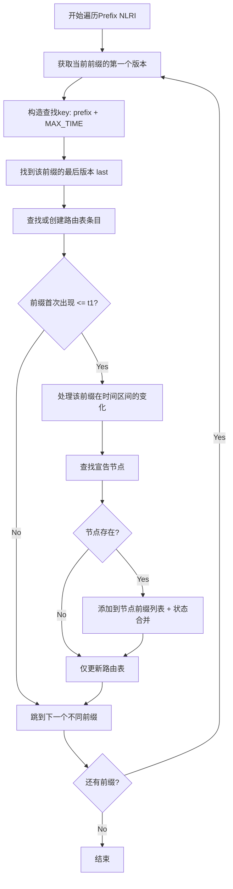

# TVR SPF Prefix构建过程详细分析

## 概述

`build_from_prefix_nlri`函数负责从TVR数据库的Prefix NLRI中构建前缀信息，这是TVR SPF构建过程的第三阶段，也是最复杂的阶段。它需要同时维护两种数据结构：节点的前缀宣告列表和全局路由表。

## 函数签名和参数

```c
static void build_from_prefix_nlri(
    struct node_rb_head *node_set,      // 已构建的节点集合
    struct route_rb_head *route_set,    // 路由表（输出）
    struct pnlri_rb_head *nlri_set,     // Prefix NLRI数据库
    uint64_t t1, uint64_t t2            // 时间区间
)
```

## 前缀构建的双重目标

### 1. 节点前缀宣告 (Node-Prefix Association)
为每个节点建立它在指定时间区间内宣告的前缀列表：
```
node.prefixes = [prefix1, prefix2, ...]
```

### 2. 全局路由表 (Global Route Table)
为每个前缀创建路由条目，用于SPF计算结果存储：
```
route_table = {prefix1 → route_info, prefix2 → route_info, ...}
```

## 详细算法流程

### 第一层循环：遍历所有前缀



### 核心代码分析

#### 1. 前缀版本查找
```c
// 获取该前缀的所有时间版本的起始点
cur = pnlri_rb_first(nlri_set);

// 为每个独特的前缀找到其最后一个版本
memcpy(&key, cur, sizeof(struct tvr_prefix_nlri));
key.time_stamp = UINT64_MAX;  // 设置为最大时间戳
last = pnlri_rb_find_lt(nlri_set, &key);  // 找到该前缀的最后版本
```

**查找逻辑**：
- `cur`: 指向某个前缀的第一个时间版本
- `last`: 指向同一前缀的最后一个时间版本
- 通过设置`key.time_stamp = UINT64_MAX`，`find_lt`会返回该前缀的最新版本

#### 2. 路由表条目预创建
```c
route = route_rb_find(route_set,
    &(struct tvr_route) {
        .prefixlen = cur->prefixlen,
        .prefix = cur->prefix
    }
);
if(route == NULL) {
    route = tvr_route_create(cur);  // 创建新路由条目
    route_rb_add(route_set, route); // 添加到路由表
}
```

**设计思想**：
- **预创建策略**: 即使没有宣告节点，也会创建路由条目
- **原因**: 确保SPF算法能找到所有可能的目标前缀
- **初始状态**: `dist = TVR_INF_DIST` (无穷大距离)

#### 3. 时间有效性检查
```c
if(cur->time_stamp <= t1) {
    // 该前缀在t1时刻已经存在，需要处理
    key.time_stamp = t1 + 1;
    cur = pnlri_rb_find_lt(nlri_set, &key);  // 找到t1时刻的有效版本
    // ... 处理逻辑
}
```

**时间逻辑**：
- 只处理在`t1`时刻已经存在的前缀
- `t1 + 1`的技巧：找到时间戳 ≤ t1的最新版本

#### 4. 节点关联和前缀创建
```c
node = node_rb_find(node_set, 
    &(struct tvr_node) {
        .local_node = cur->local_node
    }
);
if(node != NULL) {
    struct tvr_nprefix *nprefix = tvr_nprefix_create(cur);
    listnode_add(node->prefixes, nprefix);
    // ... 状态合并逻辑
}
```

**关联逻辑**：
- 查找宣告该前缀的节点
- 只有节点存在时才建立关联
- 创建`tvr_nprefix`对象并添加到节点的前缀列表

#### 5. 时间区间状态合并
```c
while(cur != last && nprefix->spf_status != TVR_UNREACH_STATUS) {
    next = pnlri_rb_next_safe(nlri_set, cur);
    if(next->time_stamp <= t2) {
        nprefix->spf_status = merge_spf_status(
            next->attr.spf_status, nprefix->spf_status);
    } else {
        break;
    }
    cur = next;
}
```

**状态合并规则**：
- 遍历`[t1, t2]`区间内的所有状态变化
- 使用`merge_spf_status`取最严格状态
- 如果状态变为`UNREACH`，停止合并（最严格状态）

### 状态合并逻辑详解

```c
static uint8_t merge_spf_status(uint8_t a, uint8_t b) {
    if(a == TVR_UNREACH_STATUS || b == TVR_UNREACH_STATUS) {
        return TVR_UNREACH_STATUS;  // 最严格：不可达
    }
    if(a == TVR_NOTRANS_STATUS || b == TVR_NOTRANS_STATUS) {
        return TVR_NOTRANS_STATUS;  // 中等：不转发（前缀通常不使用此状态）
    }
    return TVR_DEFAULT_STATUS;      // 最宽松：正常
}
```

**优先级**: `UNREACH(1) > NOTRANS(2) > DEFAULT(0)`

## 数据结构关系

### 输入数据结构 (Prefix NLRI Database)

```
pnlri_rb_tree: {
    {local_node=1001, prefix=2001:db8:1::/64, time=100, status=DEFAULT, seq=1},
    {local_node=1001, prefix=2001:db8:1::/64, time=200, status=UNREACH, seq=2},
    {local_node=1001, prefix=2001:db8:2::/64, time=150, status=DEFAULT, seq=1},
    {local_node=1002, prefix=2001:db8:1::/64, time=120, status=DEFAULT, seq=1},
    ...
}
```

### 输出数据结构

#### 1. 节点的前缀列表
```c
node_1001.prefixes = [
    {prefix=2001:db8:1::/64, spf_status=MERGED_STATUS},
    {prefix=2001:db8:2::/64, spf_status=DEFAULT},
    ...
]

node_1002.prefixes = [
    {prefix=2001:db8:1::/64, spf_status=DEFAULT},
    ...
]
```

#### 2. 全局路由表
```c
route_table = {
    2001:db8:1::/64 → {dist=INF, next_hop=undefined},
    2001:db8:2::/64 → {dist=INF, next_hop=undefined},
    ...
}
```

## 时间处理示例

### 场景：计算时间区间 [150, 250]

**数据库中的Prefix NLRI**:
```
Prefix 2001:db8:1::/64:
  - t=100: node=1001, status=DEFAULT
  - t=200: node=1001, status=UNREACH  
  - t=300: node=1001, status=DEFAULT

Prefix 2001:db8:2::/64:
  - t=180: node=1002, status=DEFAULT
```

**处理过程**:

1. **处理 2001:db8:1::/64**:
   - `cur`指向t=100版本，`last`指向t=300版本
   - `cur->time_stamp(100) <= t1(150)` ✓
   - 找到t1时刻有效版本：t=100 (status=DEFAULT)
   - 在路由表创建条目
   - 查找node=1001 ✓，创建nprefix并添加
   - 状态合并：t=200在[150,250]内，合并UNREACH
   - 最终状态：UNREACH

2. **处理 2001:db8:2::/64**:
   - `cur`指向t=180版本，`last`指向t=180版本
   - `cur->time_stamp(180) <= t1(150)` ✗
   - 跳过处理，但仍在路由表中创建条目

**结果**:
```
node_1001.prefixes = [{prefix=2001:db8:1::/64, status=UNREACH}]
node_1002.prefixes = [] (因为t=180 > t1=150)
route_table = {
    2001:db8:1::/64 → {dist=INF, next_hop=undefined},
    2001:db8:2::/64 → {dist=INF, next_hop=undefined}
}
```

## 跳转逻辑分析

### 前缀分组跳转

```c
cur = pnlri_rb_next_safe(nlri_set, last);
```

**关键点**：
- `last`是当前前缀的最后一个版本
- `next_safe(last)`跳转到下一个不同前缀的第一个版本
- 这确保了外层循环按前缀分组处理

**示例**：
```
数据库顺序：
prefix_A@t1 → prefix_A@t2 → prefix_A@t3 → prefix_B@t1 → prefix_B@t2

处理流程：
1. cur=prefix_A@t1, last=prefix_A@t3
2. 处理prefix_A的所有版本
3. cur=next_safe(prefix_A@t3) = prefix_B@t1
4. cur=prefix_B@t1, last=prefix_B@t2
5. 处理prefix_B的所有版本
```

## 设计特点和优化

### 1. 双重数据结构维护
- **节点前缀列表**: 用于SPF算法中的前缀宣告查找
- **全局路由表**: 用于存储SPF计算结果和路由查找

### 2. 预创建策略
```c
// 始终创建路由条目，即使没有宣告节点
if(route == NULL) {
    route = tvr_route_create(cur);
    route_rb_add(route_set, route);
}
```
**优势**: 确保SPF算法能找到所有目标前缀，避免运行时创建

### 3. 时间一致性
- 与节点和链路构建使用相同的时间处理逻辑
- 确保整个拓扑的时间一致性

### 4. 状态传播
- 前缀状态会影响SPF算法中该前缀的可达性
- `UNREACH`前缀不会被安装到路由表

## 复杂度分析

### 时间复杂度
- **外层循环**: O(P)，P为前缀总数
- **前缀查找**: O(log P)，红黑树查找
- **节点查找**: O(log N)，N为节点数
- **状态合并**: O(V)，V为该前缀的版本数
- **总体**: O(P × (log P + log N + V))

### 空间复杂度
- **路由表**: O(U)，U为唯一前缀数
- **前缀宣告**: O(A)，A为宣告关系数
- **总体**: O(U + A)

## 与其他阶段的关系

### 依赖关系
```
Phase 1: build_from_node_nlri → 创建节点集合
Phase 2: build_from_link_nlri → 为节点添加链路
Phase 3: build_from_prefix_nlri → 为节点添加前缀，创建路由表
```

### 数据流
```
Prefix NLRI DB → [build_from_prefix_nlri] → {
    node.prefixes: 用于SPF计算
    route_table: 用于结果存储
}
```

## 总结

`build_from_prefix_nlri`是TVR SPF构建过程中最复杂的阶段，它实现了：

1. **双重关联**: 前缀既关联到宣告节点，也存储在全局路由表
2. **时间一致性**: 处理指定时间区间内的前缀状态变化  
3. **预创建策略**: 为所有前缀创建路由条目，确保SPF算法完整性
4. **状态合并**: 取时间区间内最严格的前缀状态
5. **高效跳转**: 按前缀分组处理，避免重复遍历

这种设计确保了TVR SPF算法能够正确处理时变网络中的前缀宣告和路由计算。
